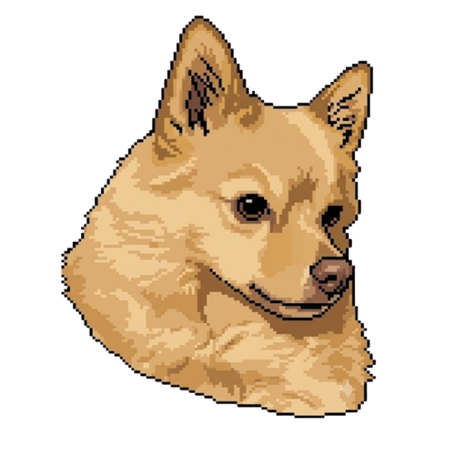

# pocket-artemis
##### _Pocket Artemis_



## About
**Pocket Artemis** is a cosy tamagotchi game starring Artemis, a Pomeranian-husky mix, built with Lua and [LOVE2D](https://love2d.org). Feed her, water her, play with her, teach her tricks — and try not to let her get too sad.

## Features
- Four needs (hunger, thirst, energy, happiness) with real-time and offline decay
- Mood system derived from average need satisfaction
- Tricks: Sit, Shake, Spin, Lie Down, Roll Over, Bear
- Treat Catch mini-game with difficulty ramp
- Sprite sheet animations with idle behaviour system
- Retro handheld skins (GBC/GBA) via [love2d4me](https://github.com/andrewiankidd/love2d4me)
- Web build via love.js (WASM)

### Links
<p align="center">
    <a href="https://andrewiankidd.github.io/pocket-artemis/">
        
    </a>
    <br>
    <strong>Play:</strong>
    <br>
    <a href="https://andrewiankidd.github.io/pocket-artemis/Web/index.html">
        
    </a>
    <a href="https://github.com/andrewiankidd/pocket-artemis/releases/download/latest-main/pocket-artemis-love.zip">
        
    </a>
    <br>
    <strong>Source Code:</strong>
    <br>
    <a href="https://github.com/andrewiankidd/pocket-artemis">
        
    </a>
    <br>
    <a href="https://github.com/andrewiankidd/pocket-artemis/actions/workflows/publish.yml">
        
    </a>
</p>

## Running locally

    npm run setup      # install npm deps + download LOVE 11.5
    npm start          # launch the game

### Development

    npm run dev        # launch with auto-reload on file changes

### Web build

    npm run build      # pack src/ into .love, compile to Web/ via love.js
    npm run serve      # serve Web/ at http://localhost:8080

## Controls

| Button | Action |
|--------|--------|
| D-pad left/right | Navigate toolbar |
| A / Confirm | Activate selected item |
| B / Cancel | Go back |
| START | Pause |
| SELECT | Cycle tabs |

## Project Structure

```
src/
├── game/
│   ├── config.json          # game config (title, resolution, default skin)
│   ├── pet.lua              # main game logic (meters, actions, tricks, drawing)
│   ├── icons/               # meter bar icons (hunger, thirst, energy, happiness)
│   └── sprites/
│       ├── artemis.png      # sprite sheet (5x7 grid, 200x250 cells)
│       ├── artemis.psd      # source PSD
│       └── sprites.json     # animation definitions (rows, cols, frame counts)
├── love2d4me/               # shared framework (git submodule) — skins, input, resolution, etc.
├── main.lua                 # entry point
└── conf.lua                 # LOVE2D config
```

## License

MIT License. See `LICENSE` file for details.
